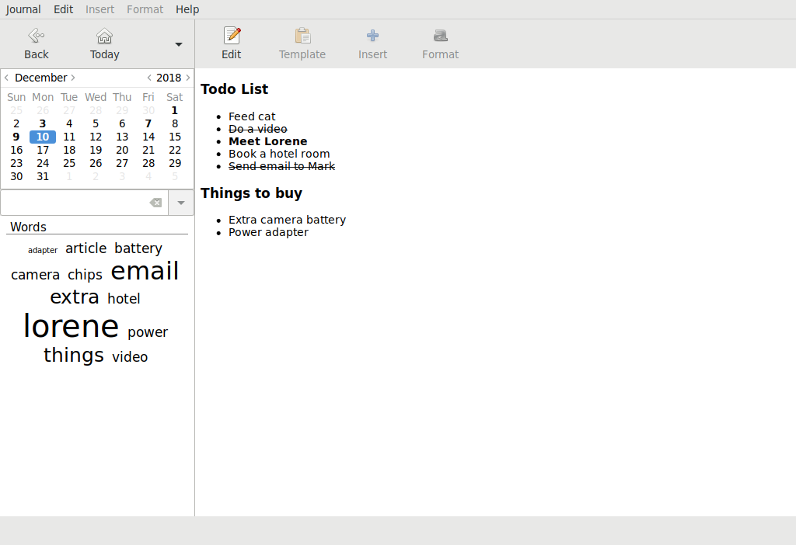

# rednotebook-flatpak

**RedNotebook** is a modern desktop journal. It lets you format, tag and search your entries. You can also add pictures, links and customizable templates, spell check your notes, and export to plain text, HTML, Latex or PDF.



[Homepage](https://rednotebook.sourceforge.io)

This repo is about the flatpak package.

## Instructions

### Requirements

* [flatpak](https://github.com/flatpak/flatpak)
* [flatpak-builder](https://github.com/flatpak/flatpak-builder)

For EL7:

```
# yum install 'flatpak' 'flatpak-builder'
```

You may also wish to install the `xdg-desktop-portal*` packages:

```
# yum install 'xdg-desktop-portal*'
```

See also:

* [flatpak setup](https://flatpak.org/setup)

### Adding repository

```
$ flatpak remote-add --if-not-exists "flathub" "https://dl.flathub.org/repo/flathub.flatpakrepo"
```

See also:

* [flathub setup](http://docs.flatpak.org/en/latest/using-flatpak.html#add-a-remote)

### Prepare

```
$ flatpak install "flathub" "org.gnome.Sdk//3.32"
```

```
$ flatpak install "flathub" "org.gnome.Platform//3.32"
```

### Build

```
$ flatpak-builder "build" "app.rednotebook.RedNotebook.yaml" --force-clean --install-deps-from="flathub"
```

### Test

```
$ flatpak-builder --run "build" "app.rednotebook.RedNotebook.yaml" "sh"
```

### Test run

```
$ flatpak-builder --run "build" "app.rednotebook.RedNotebook.yaml" "rednotebook"
```

### Install

```
$ flatpak-builder --repo="repo" --force-clean "build" "app.rednotebook.RedNotebook.yaml"
```

```
$ flatpak --user remote-add --no-gpg-verify "rednotebook" "repo"
```

```
$ flatpak --user install "rednotebook" "app.rednotebook.RedNotebook"
```

### Run

```
$ flatpak run "app.rednotebook.RedNotebook"
```

### Uninstall

```
$ flatpak --user uninstall "app.rednotebook.RedNotebook"
```

```
$ flatpak --user remote-delete "rednotebook"
```

See also: [Building your first Flatpak](http://docs.flatpak.org/en/latest/first-build.html)

## FAQ

### Why not a RPM package?

There are already [packages](https://pkgs.org/download/rednotebook) for various distributions. However, they may be outdated.

### Are you the author of RedNotebook?

No, I only created the flatpak package for it.

See also:

* [GitHub repo](https://github.com/jendrikseipp/rednotebook)

